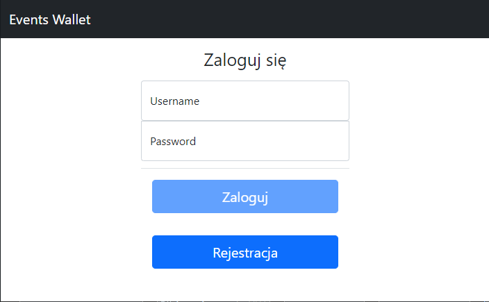
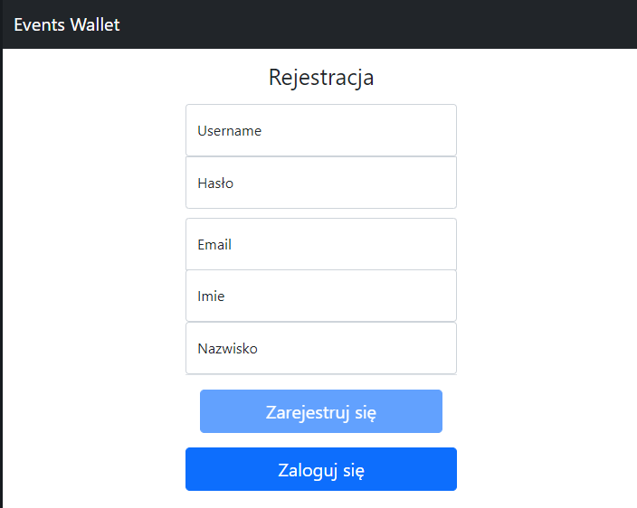
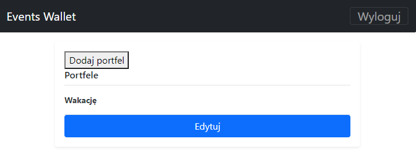
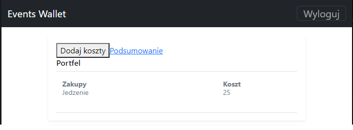
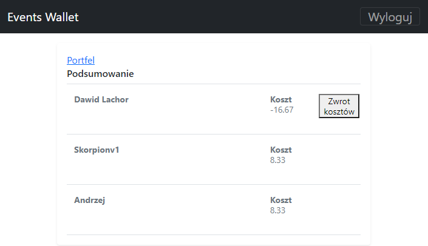

# Event Wallet - Frontend

Event Wallet is a web application. It was made for classes in "Projekt Inżynierskiego". 

This application helps in settling accounts between friends. We enter our costs and the application calculates how much people in the wallet are owed. 

Link to Backend: https://github.com/DawidLachor/EventWallet

## Technologies
* Angular 12
* TypeScript
* Bootstrap 5

## Development server

First, download the backend, configure the database and run. 

Secondly, download the frontend and enter `npm install` in the terminal and wait for everything to install. 

Run `ng serve` for a dev server. Navigate to `http://localhost:4200/`. The app will automatically reload if you change any of the source files.

## Event Wallet pages
### Login

### Registration

### Wallet

### Cost

### Summary

